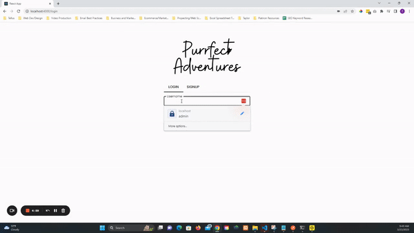
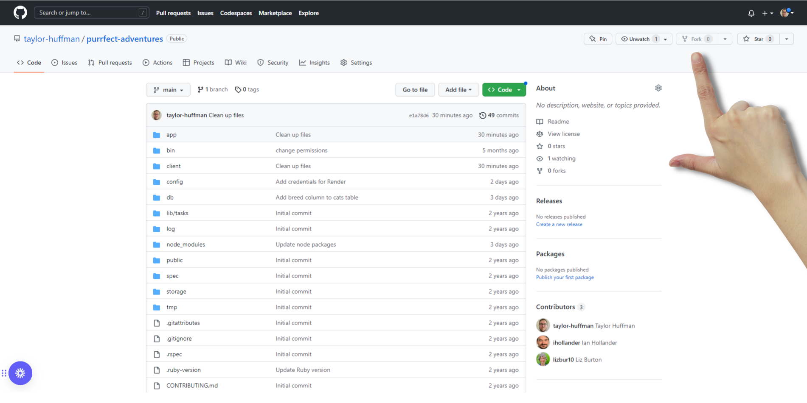
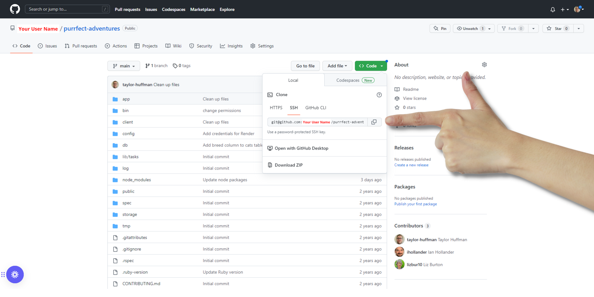

# Purrfect Adventures

## Description
Purrfect Adventures is a simple, social-media style app for sharing your Cat's adventures.



## Requirements

- Ruby 2.7.4
- NodeJS (v16), and npm
- Postgresql

See Environment Setup below for instructions on installing these tools if you
don't already have them.

## Project Setup
Start by forking the frontend of the project



Next, grab your SSH key. (Make sure you see your user name where the red text is)



Next, navigate to your desired folder in Ubuntu and type in the following command to clone your newly created repo, making sure your username is taking place of 'your-user-name' in the url:

```
git clone git@github.com:your-user-name/purrfect-adventures.git
```

Then, navigate to the root folder of the project:

```
cd purrfect-adventures/
```

Once in the root folder, copy and paste the following command to open VS Code:

```
code .
```

Once VS Code is open, click " Ctrl + ` " to open the VS Code terminal, then type in the following commands to install the project dependencies and create your database:
```
bundle install
rails db:create
npm install --prefix client
```

Once that's done, type the following commands in the terminal:
```
rails s
npm start --prefix client
```
And there you have it, the Purrfect Adventures app should now be open in your browser and you should have both the frontend and backend files open in VSCode, ready to modify as you see fit!

## Operating Instructions
Now that you've finished setting up the project, simply visit the page in your browser (http://localhost:4000/) and click the signup tab to create an account, or click the login tab to login.

## Environment Setup

### Install the Latest Ruby Version

Verify which version of Ruby you're running by entering this in the terminal:

```console
$ ruby -v
```

We recommend version 2.7.4. If you need to upgrade you can install it using rvm:

```console
$ rvm install 2.7.4 --default
```

You should also install the latest versions of `bundler` and `rails`:

```console
$ gem install bundler
$ gem install rails
```

### Install NodeJS

Verify you are running a recent version of Node with:

```sh
node -v
```

If your Node version is not 16.x.x, install it and set it as the current and
default version with:

```sh
nvm install 16
nvm use 16
nvm alias default 16
```

You can also update your npm version with:

```sh
npm i -g npm
```

### Install Postgresql

Render requires that you use PostgreSQL for your database instead of SQLite.
PostgreSQL (or just Postgres for short) is an advanced database management
system with more features than SQLite. If you don't already have it installed,
you'll need to set it up.

#### PostgreSQL Installation for WSL

To install Postgres for WSL, run the following commands from your Ubuntu terminal:

```sh
sudo apt update
sudo apt install postgresql postgresql-contrib libpq-dev
```

Then confirm that Postgres was installed successfully:

```sh
psql --version
```

Run this command to start the Postgres service:

```sh
sudo service postgresql start
```

Finally, you'll also need to create a database user so that you are able to
connect to the database from Rails. First, check what your operating system
username is:

```sh
whoami
```

If your username is "ian", for example, you'd need to create a Postgres user
with that same name. To do so, run this command to open the Postgres CLI:

```sh
sudo -u postgres -i
```

From the Postgres CLI, run this command (replacing "ian" with your username):

```sh
createuser -sr ian
```

Then enter `control + d` or type `logout` to exit.

[This guide][postgresql wsl] has more info on setting up Postgres on WSL if you
get stuck.

[postgresql wsl]: https://docs.microsoft.com/en-us/windows/wsl/tutorials/wsl-database#install-postgresql

#### Postgresql Installation for OSX

To install Postgres for OSX, you can use Homebrew:

```sh
brew install postgresql
```

Once Postgres has been installed, run this command to start the Postgres
service:

```sh
brew services start postgresql
```

## Troubleshooting

If you ran into any errors along the way, here are some things you can try to
troubleshoot:

- If you're on a Mac and got a server connection error when you tried to run
  `rails db:create`, one option for solving this problem for Mac users is to
  install the Postgres app. To do this, first uninstall `postgresql` by running
  `brew remove postgresql`. Next, download the app from the
  [Postgres downloads page][] and install it. Launch the app and click
  "Initialize" to create a new server. You should now be able to run
  `rails db:create`.

- If you're using WSL and got the following error running `rails db:create`:

  ```txt
  PG::ConnectionBad: FATAL:  role "yourusername" does not exist
  ```

  The issue is that you did not create a role in Postgres for the default user
  account. Check [this video](https://www.youtube.com/watch?v=bQC5izDzOgE) for
  one possible fix.

[postgres downloads page]: https://postgresapp.com/downloads.html

## Media and Data Credits
Images from https://canva.com

## Contact Me For Questions
Have any questions? Feel free to shoot me an email: [taylor@crucialartists.com](mailto:taylor@crucialartists.com)

## MIT License
[Click to view license information](./MIT-LICENSE)


<!-- # Project Template: React/Rails API

## Description

This project is scaffolded so that you can build a React frontend and Rails
backend together, and easily deploy them to Render.

**Note**: if you are not planning to deploy your app to Render and prefer to use
SQLite, you will need to make the following changes in the project files:

1. In the `Gemfile`, replace `gem 'pg', '~> 1.1'` with `gem 'sqlite3', '~>
   1.4'`.
2. In the `database.yml` file, change the line `adapter: postgresql` to
   `adapter: sqlite3`.

## Requirements

- Ruby 2.7.4
- NodeJS (v16), and npm
- Render account
- Postgresql

See Environment Setup below for instructions on installing these tools if you
don't already have them.

## Setup

Start by **cloning** (not forking) the project template repository and removing
the remote:

```console
$ git clone git@github.com:learn-co-curriculum/project-template-react-rails-api.git your-project-name
$ cd your-project-name
$ git remote rm origin
```

Then, [create a new remote repository][create repo] on GitHub. Head to
[github.com](https://github.com) and click the **+** icon in the top-right
corner and follow the steps to create a new repository. **Important**: don't
check any of the options such as 'Add a README file', 'Add a .gitignore file',
etc. — since you're importing an existing repository, creating any of those
files on GitHub will cause issues.

[create repo]: https://docs.github.com/en/github/importing-your-projects-to-github/importing-source-code-to-github/adding-an-existing-project-to-github-using-the-command-line#adding-a-project-to-github-without-github-cli

If you're working with a partner,
[add them as a collaborator][add collaborator] on GitHub. From your repo on
GitHub, go to Settings > Manage Access > Invite a collaborator and enter your
partner's username. Once your partner has access, they should git **clone** (not
fork) the repository.

[add collaborator]: https://docs.github.com/en/account-and-profile/setting-up-and-managing-your-github-user-account/managing-access-to-your-personal-repositories/inviting-collaborators-to-a-personal-repository

Finally, connect the GitHub remote repository to your local repository and push
up your code:

```console
$ git remote add origin git@github.com:your-username/your-project-name.git
$ git push -u origin main
```

When you're ready to start building your project, run:

```sh
bundle install
rails db:create
npm install --prefix client
```

You can use the following commands to run the application:

- `rails s`: run the backend on [http://localhost:3000](http://localhost:3000)
- `npm start --prefix client`: run the frontend on
  [http://localhost:4000](http://localhost:4000)

Make sure to also update this README to include documentation about
your project. Here's a list of some [awesome readmes][] for inspiration.

[awesome readmes]: https://github.com/matiassingers/awesome-readme -->
